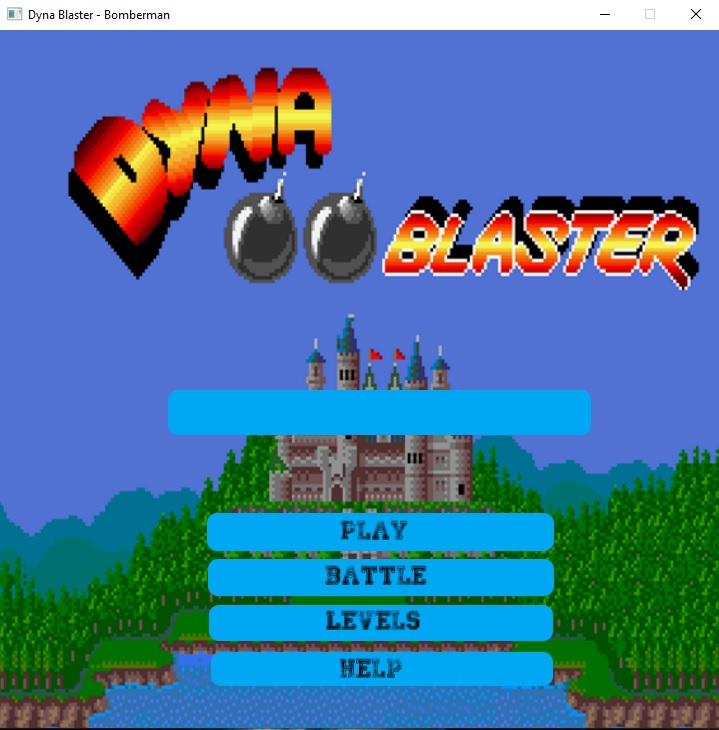
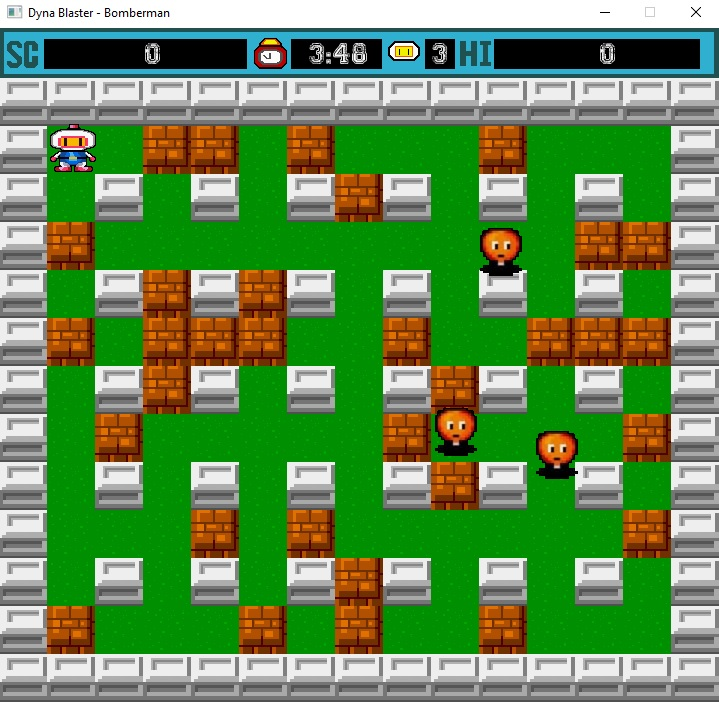
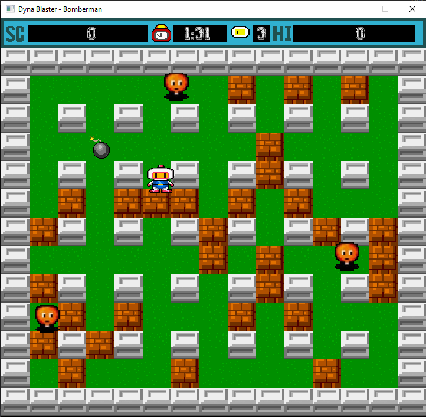
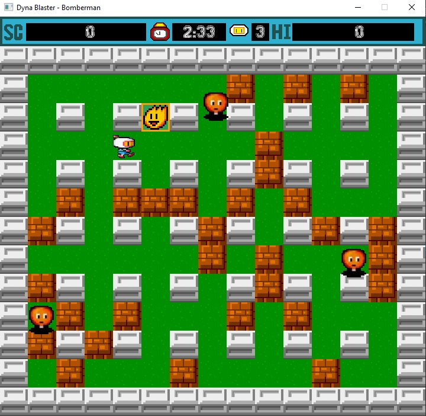
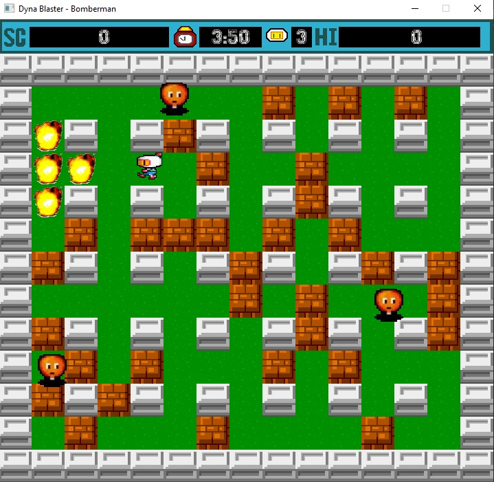
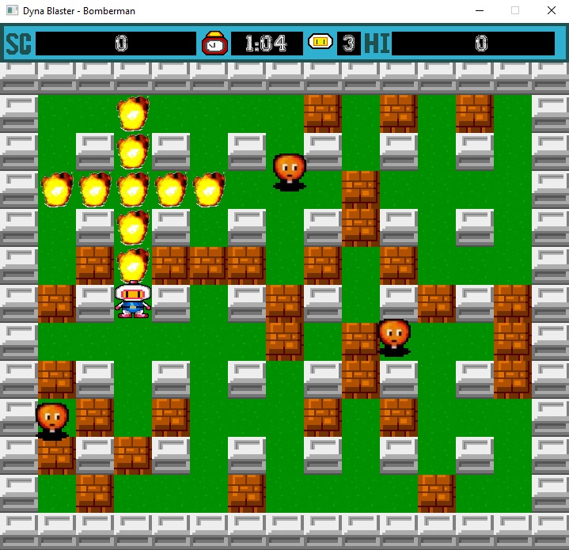

# Dyna Blaster - Bomberman

- This project is an implementation of Dyna Blaster in C++.
- It was a teamwork project that I worked with my colleagues from university [Gabriela Burtan](https://github.com/gabrielaburtan), [Bogdan Gheorghe](https://github.com/DodeBogdan) and [Daniela Boncu](https://github.com/DanielaBoncu).
- This project was realised as part of our laboratories for Standard to Modern C++.
- It has mostly modern C++ code, some UnitTests, a dll and it uses an external library, SFML for graphics and music.
- The file [DynaBlasterDemo.mp4](DynaBlasterDemo.mp4) is a video presentation of the app in Romanian. In this video are presented the GUI and the implementation of the app.

> First of all, we had tried to keep the pixelated interface of the original game and so we had to modify the images, used as textures, pixel by pixel.

> Second of all, we had implemented most of the functionalities of the original game and kept the music from the original game.

- The home page looks like this - it has 4 buttons with different purposes.

- In the game window we have the original score bar with a timer, a life counter, a score and a high score. The walls, the player and the enemies are just like in the original game.

- When the user presses space a bomb is placed.

|  |  |
|:---:|:---:|

- When the bomb timer expires, the explosion is triggered.

- Under a wall is hidden a power up.

|  |  | 
|:---:|:---:|

- The first power up is Explosion Increaser which increases the range of the explosion.

